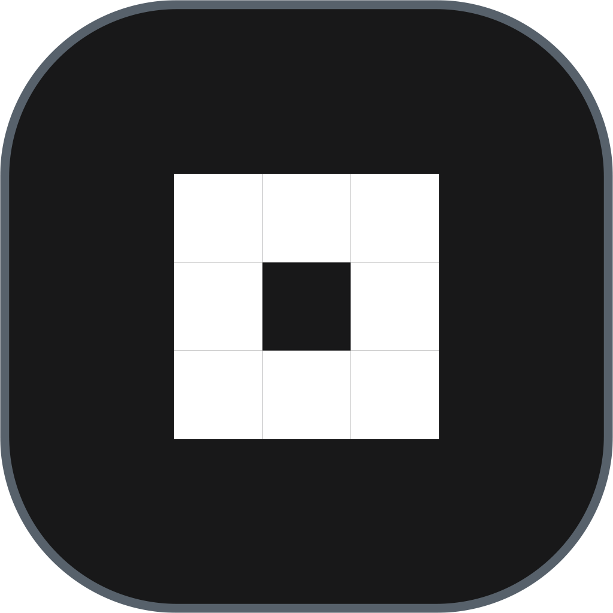
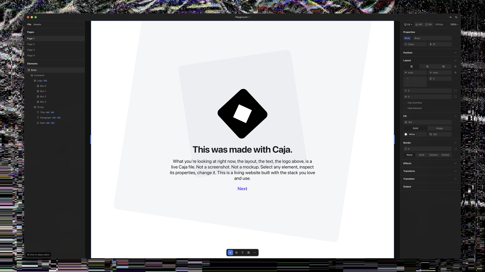

<p align="center">
  
</p>

<h1 align="center">Caja</h1>

<p align="center">
  <strong>Design Is Code</strong><br>
  What you design is what you ship.
</p>

<p align="center">
  <a href="https://getcaja.app">Website</a> &middot;
  <a href="https://docs.getcaja.app">Docs</a> &middot;
  <a href="https://github.com/getcaja/caja/releases">Download</a> &middot;
  <a href="https://github.com/getcaja/caja/issues">Issues</a>
</p>

---



## What is Caja?

A visual editor where what you design is what you ship. Build layouts on canvas, let AI build for you, or both — no translation layer, the tech you already use.

- **WYDISWYS** — What You Design Is What You Ship. No translation layer, no compiled output — pure HTML + CSS
- **AI-native** — Built for AI agents from day one. Claude, Cursor, or any MCP client builds layouts directly on canvas
- **Bidirectional Tailwind** — Design visually, get real tokens. `gap-4` not `gap-[16px]`. Paste classes back, keep designing
- **Components** — Save any frame as a reusable component with named slots. Export `.cjl` libraries to share across projects
- **Native macOS app** — Fast, offline, local file storage. Built with Tauri
- **Multi-page** — Create full sites with multiple pages and routing

## Getting Started

### Download

Grab the latest release from the [Releases page](https://github.com/getcaja/caja/releases). Free and open source.

### Build from Source

```bash
git clone https://github.com/getcaja/caja.git
cd caja
npm install
npm run tauri:dev
```

**Requirements:** Node.js 18+, Rust 1.70+

### AI Integration

Caja includes a built-in MCP server with 33+ tools. Click the plug icon in the title bar or run:

```
Ask Claude: "Design a landing page in Caja"
```

Create frames, style with Tailwind, manage pages, export patterns, and more — all from your AI agent of choice.

## Tech Stack

- **Frontend:** React 19, TypeScript, Tailwind CSS v4
- **Desktop:** Tauri v2 (Rust)
- **UI:** Radix primitives, Lucide icons
- **AI:** Model Context Protocol (MCP)

## License

[AGPL-3.0](LICENSE)